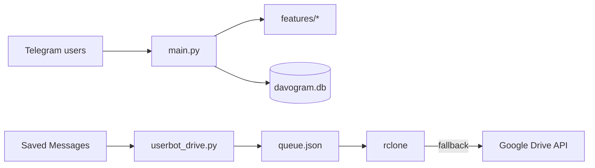

# Arquitectura de DavoGram

Dos procesos distintos.

## Bot (`main.py`)

python-telegram-bot + APScheduler. Usuarios Free / Premium / Admin. Pagos con Telegram Stars. ConversationHandlers para recordatorios, eventos y alertas de precio (yfinance).

Módulos en `features/`: `free`, `premium`, `admin`, `games`, `utils`, `social`, `ai`, `drive`.

## Userbot (`userbot_drive.py`)

Pyrogram, chat `"me"` únicamente. Cola persistente, lock de descarga, semáforo de subida. rclone es el camino feliz; la API de Drive es el respaldo resumable. No reencoda el archivo.

## Secretos

En el repo público, `config.py` y el userbot leen `os.environ`. No hay sesiones, ni JSON de Google, ni SQLite.
